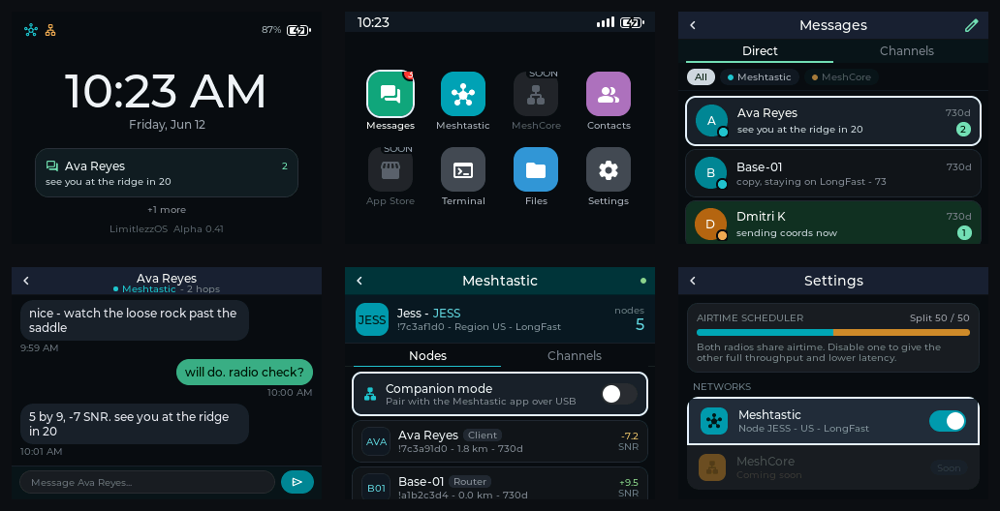

# LimitlezzOS

A mesh-native handheld OS for the **LilyGO T-Deck** (ESP32-S3, SX1262 LoRa,
320×240 TFT, BlackBerry QWERTY, trackball) that unifies **Meshtastic** and
**MeshCore** into a single network-tagged inbox, driven entirely by the
trackball.

It is a working **Beta 0.6**: real LVGL 8.3 firmware (display via LovyanGFX),
a desktop SDL2 simulator sharing the exact same UI code, and a live dual-stack
**Meshtastic + MeshCore** radio stack on the one SX1262 (time-shared by a
split-airtime scheduler), plus a USB/BLE companion bridge — flashed and tested
on real T-Deck hardware. The UI
follows the design handoff (`docs/design/`) exactly as the master spec
prescribes: flat solid fills, 1px hairlines, a 2px near-white focus ring, baked
font tables, no images, no gradients, no alpha layering — now moving toward an
iPhone-style dark look (status bar, battery glyph, grouped settings cards).

> 🚀 **Public Beta release (Beta 0.6).** It runs on real
> hardware and the core **Meshtastic** experience is genuinely usable — encrypted
> DMs both ways, channel messaging, a USB companion bridge, lock-screen
> notifications — but some features are still unfinished (see below). The
> near-term goal is to make this a great Meshtastic OS, on par with the official
> device UI (MUI), before fully building out **MeshCore**. Status reflects
> hands-on hardware testing as of **2026-06-13**.

## Beta status

### ✅ Working (hardware-tested)
- **Display, screens & navigation** — renders cleanly, tear-free, screen-to-screen nav.
- **Trackball + QWERTY keyboard** — focus, scroll, typing, back gesture.
- **Touchscreen** — tap items/tabs/buttons/toggles; **3-tap on-screen calibration** (Settings → Calibrate touch) that any T-Deck can run, persisted across reboot.
- **Clock** — status-bar time, NTP sync over Wi-Fi, named timezone picker, automatic DST (US/EU), **12-hour (AM/PM) or 24-hour** format.
- **Meshtastic channel messaging (LongFast)** — send **and** receive on the public channel.
- **Meshtastic direct messages (PKI)** — encrypted DMs both ways with real nodes
  (X25519 + AES-256-CCM), keys exchanged via NodeInfo and **persisted across
  reboots**; we send a ROUTING ack so the sender sees "delivered". Hardware-verified.
- **Node discovery** — heard nodes list (name, SNR, last-heard); holds up to 250
  nodes (matches MUI), evicting the stalest when full.
- **Message history** — persists across leaving a chat and across reboots (SD card).
- **Compose** — long drafts scroll within the input box instead of overflowing.
- **Wi-Fi** — scan, connect, saved password, auto-connect toggle, forget; T-Deck
  hardware stores saved credentials in ESP32 NVS instead of plaintext SD files.
- **User settings** — network toggles, brightness, sleep timeout, keyboard
  light, TX power, time zone, clock format, GPS toggle, and power saving persist.
- **Battery & charging** — live percentage + charge state; System page telemetry.
- **Keyboard backlight** — Auto / On / Off (I²C).
- **Sleep & power saving** — idle dim/sleep, CPU down-clock.
- **MeshCore self-advert (TX)** — signed Ed25519 advert broadcasts (flood + zero-hop); persistent identity; Advertise buttons only shown when MeshCore is on.
- **Split airtime (TDM)** — both networks on → SX1262 alternates MC↔MT every 500 ms; one on → 100%.
- **Companion bridge (Meshtastic over USB)** — pair the official Meshtastic app over
  USB serial (Nodes tab → Companion mode): full handshake, live node DB, and
  send/receive through the T-Deck's own radio. Hardware-verified.
- **Lock-screen notifications** — a centered new-message card; tap it to open the chat
  (clears once you view it); **"+N more"** when several conversations are unread.
- **Tap-to-wake, then tap-to-unlock** — the first touch/key only lights the screen; a
  second one unlocks, so a bump in your pocket can't open it.
- **Virtualized lists** — the node list renders only the on-screen rows (+2 buffer) and
  recycles them as you scroll, so a large mesh can't exhaust memory.
- **iPhone-style dark UI** — status bar (time on the left; signal bars + Wi-Fi + a white
  battery glyph on the right), grouped Settings cards with hairline dividers, and
  enabled-network icons on the lock screen.
- **Unread, at a glance** — unread chats are highlighted in the list, the Messages icon
  carries a red counter badge (1–9, then "9+"), and you can **long-press any chat to
  silence it** (crescent moon; no notification, no badge).
- **sym + L = lock** — a keyboard shortcut to drop straight to the lock screen from
  anywhere (still types a `"` inside a message, password, or the terminal).
- **Developer Mode gate** — Terminal is hidden from Home by default and only
  appears after enabling Developer Mode in Settings.
- **Serial console** — USB-CDC command shell for control + diagnostics (`help`, `time`, `tz`, `net`, `rf`, `mc`, `companion`, `touch`, …).

### ✅ Working — MeshCore (Beta 0.6)
- **MeshCore Public chat** — send/receive on the default Public channel,
  hardware-verified against a live mesh, in the same unified inbox as Meshtastic.
- **MeshCore encrypted DMs** — per-pair X25519 ECDH + AES, ACK/delivery state,
  hardware-verified against a real MeshCore peer.
- **Split airtime** — the one SX1262 is time-shared between Meshtastic and MeshCore
  by a scheduler that never cuts an in-flight RX/TX. Hardware-verified: both networks
  on → SPLIT mode, dwell per preset, ~6 switches/s, both receiving. Presets ship in
  Settings + the `airtime` serial command (MT 60/40, Balanced 50/50, MC 40/60).

### 🧪 In testing
- **Meshtastic BLE companion** — the firmware exposes the official Meshtastic
  BLE GATT service (`ToRadio`, `FromRadio`, `FromNum`) through NimBLE, advertises,
  and the official app discovers + connects. **Open bug:** the session drops on
  connect (reboot-on-connect) — PR #4's want_config pacing + FromNum coalescing is
  merged and the device advertises without crashing; phone-connect retest pending.
  (Wi-Fi and BLE are mutually exclusive on this RAM-tight ESP32-S3; enabling one
  frees the other.)
  and the official Android app discovers + connects. Serial `companion` status
  now reports connect/disconnect counts, last GAP disconnect reason, negotiated
  MTU, and characteristic IO counters for phone-app drop captures; the companion
  handshake reports Meshtastic-compatible firmware metadata (`2.7.15.567b8ea`)
  so current Android builds do not reject it as too old. 2026-06-17 COM8 photo
  evidence shows Android connected to `limitlessdeck`, populated nodes, and
  LongFast send/receive through the app. Remaining checks: reconnect,
  disconnect, and coexistence soak. (Wi-Fi and BLE are mutually exclusive on
  this RAM-tight ESP32-S3; enabling one frees the other.)

### 🛠️ Roadmap — versioned plan
- ✅ **0.3** — DM profile shortcuts; **Meshtastic DMs (PKI, both ways)**; **delivery
  status** (green sending / blue delivered / red failed + long-press to resend).
- ✅ **0.4** — **USB companion** for Meshtastic: enable in the Meshtastic app (Nodes
  tab → Companion mode), then connect the official app over USB serial.
- ✅ **0.41** — **lock-screen notifications** (centered card + "+N more"),
  **tap-to-wake/unlock**, **virtualized node list** (fixes the big-mesh crash), the
  **iPhone-style dark UI** pass, and the USB companion **confirmed working on hardware**.
- ✅ **0.42** — highlight chats with unread messages (dark-mint row + brighter name).
- ✅ **0.43** — unread **counter badge** on the Messages icon (1–9, then "9+"); muted excluded.
- ✅ **0.44** — **silence** chats (long-press to mute: crescent moon, no
  notification/badge) and the **sym + L** keyboard shortcut to lock the screen from anywhere.
- ✅ **Phase 0 hardening** — persistent user settings and a **Developer Mode**
  launcher gate for Terminal.
- **0.45** — responsiveness pass in progress: conversation typing/backspace now
  updates the compose pill in place, Contacts uses virtualized rows, and Settings
  brightness adjusts without a full screen rebuild; chat rebuilds preserve scroll
  unless pinned to the newest message. Hardware regression is still open.
- ✅ **0.5** — **BLE companion** for Meshtastic: firmware GATT transport in
  place, official Android app connection and LongFast send/receive validated on
  COM8; reconnect/disconnect soak remains to repeat.
- 🚀 **0.6 — this release** — **MeshCore is live**: public-channel chat **and**
  encrypted DMs (X25519 + AES), in the same unified inbox as Meshtastic and
  time-shared on the one SX1262 by a **split-airtime scheduler** that never cuts
  an in-flight RX/TX. **BLE companion** merged and running on hardware
  (advertising + GATT mailbox; Android app connection, nodes, and LongFast
  send/receive validated; reconnect/disconnect soak next). A full
  **desktop simulator** (virtual mesh + 50+ self-test assertions) to cut hardware
  testing. **Wi-Fi and BLE are mutually exclusive** on this RAM-tight ESP32-S3 —
  enabling one frees the other.

### 🔭 Later
- **MeshCore companion bridge** — V0 protocol foundation is drafted, and an
  initial `companion mc ...` USB serial-console smoke surface can report
  snapshots and exercise send boundaries; the formal USB/BLE bridge remains
  planned, and it is not official MeshCore app compatible unless the real
  MeshCore app protocol is confirmed.
- **Roll the iPhone look everywhere** — grouped cards / dividers across Messages, Nodes, Contacts.
- **Local app platform** - scan local app manifests from `/sd/limitlezz/apps`,
  `/sd/apps`, `/appfs/apps`, and simulator data dirs, then show accepted apps
  across paged Home launcher screens and App Store detail shells. Home can open
  accepted apps in a safe SDK 0.1 foreground shell that reads bounded display
  metadata plus up to two bounded foreground actions from the entry file and
  terminates on exit. Storage-enabled actions can increment a safe counter in
  the app's scoped `data/` directory, unsupported action effects fail closed,
  and apps with matching permissions can use read-only `{time}` / `{battery}`
  tokens in foreground text. Loaded entry source plus app-controlled foreground
  metadata are charged against a 704-byte resident runtime budget. SDK
  apps with matching permissions can use read-only `{time}` / `{battery}`
  tokens in foreground text, and apps with `notifications` can request a
  feedback-service notification through a bounded `notify:` action effect. SDK
  `api_version` and permission metadata are parsed fail-closed, with rejected
  package diagnostics visible in Developer Mode. Apps that request `storage`
  get a scoped package `data/` directory prepared with a 64 KB launch-time quota
  guard, and the App Store detail screen can clear only that app's scoped data.
  Script execution, richer API injection, downloads, and updates are still TODO.
- **App flash (`appfs`)** - T-Deck builds mount the FAT `appfs` partition at
  `/appfs` without formatting, expose it beside SD/local storage in Files, and
  scan `/appfs/apps` even when the SD card is absent.
- **Security**: optional device **password/PIN**, and **encrypt the data files**
  (messages, identity, keys) when a password is set.
- **Credential hardening**: T-Deck Wi-Fi passwords are stored in ESP32 NVS, and
  legacy `/limitlezz/wifi.cfg` credentials are migrated and removed after a
  successful NVS write. Remaining security work is the optional device
  password/PIN and encrypted local data files above.

## Audit and completion plan

- [`docs/tdeck-firmware-audit.md`](docs/tdeck-firmware-audit.md) - current firmware audit and risk list.
- [`docs/tdeck-feature-inventory.md`](docs/tdeck-feature-inventory.md) - feature-by-feature implementation inventory.
- [`docs/tdeck-firmware-roadmap.md`](docs/tdeck-firmware-roadmap.md) - roadmap to a complete T-Deck firmware.
- [`docs/tdeck-meshcore-companion-protocol.md`](docs/tdeck-meshcore-companion-protocol.md) - draft Phase 5/V0.8 MeshCore companion line protocol.
- [`docs/tdeck-hardware-dogfood-checklist.md`](docs/tdeck-hardware-dogfood-checklist.md) - stock-device hardware proof checklist.
- [`docs/tdeck-release-checklist.md`](docs/tdeck-release-checklist.md) - slow-host Actions artifact and COM8 release evidence checklist.
- [`docs/tdeck-troubleshooting.md`](docs/tdeck-troubleshooting.md) - build, flash, boot, radio, storage, Wi-Fi, and companion troubleshooting.
- [`docs/tdeck-user-guide.md`](docs/tdeck-user-guide.md) - practical on-device user guide.
- [`docs/tdeck-app-developer-guide.md`](docs/tdeck-app-developer-guide.md) - SDK 0.1 local app developer guide.
- [`docs/tdeck-hardware-test-matrix.md`](docs/tdeck-hardware-test-matrix.md) - release-candidate hardware validation matrix.
- [`docs/tdeck-upgrade-path.md`](docs/tdeck-upgrade-path.md) - current USB artifact upgrade and rollback path.
- [`docs/tdeck-release-artifacts.md`](docs/tdeck-release-artifacts.md) - release binary attachment runbook.
- [`docs/tdeck-release-bug-gate.md`](docs/tdeck-release-bug-gate.md) - release P0/P1 bug gate.



## Layout

```
platformio.ini         two envs: tdeck (ESP32-S3 firmware) + native (SDL2 sim)
partitions.csv         OTA_0 / OTA_1 / otadata / config / appfs  (locked early, spec §11)
include/lv_conf.h      LVGL 8.3.11, aggressively stripped (spec §4.4)
src/ui/theme*.h        design tokens (colors computed from the design's oklch values)
src/ui/ui.{h,c}        state machine, nav stack, trackball focus engine, shared widgets
src/ui/screens/        the 13 screens (read live data from the mesh service)
src/ui/fonts/          Material Symbols Rounded subsets baked to LVGL C arrays
src/services/mesh.{h,c}  mesh service: node table, thread index, send/receive API
src/services/store.c   persistent store (messages, threads, nodes, settings)
src/services/mtproto.* Meshtastic wire codec: header, AES-CTR, channel hash, protobuf
src/services/aes_min.h portable AES-128/256-CTR for the simulator
src/services/mesh_seed.c demo mesh (matches the design's sample data)
src/backend_sx1262.cpp real Meshtastic radio over SX1262 (RadioLib) — T-Deck
sim/backend_sim.c      simulated radio (auto-reply) for the desktop sim
src/main_tdeck.cpp     hardware bring-up: ST7789, GT911 touch, keyboard, trackball, SD
sim/main_sim.c         SDL2 simulator + headless screenshots + --selftest
docs/design/           the original design handoff bundle (source of truth)
```

## Architecture: UI ↔ service ↔ radio

The UI never touches the radio. It reads nodes/threads/messages from the
**mesh service** (`src/services/`), which owns the node table and the
persistent message store and talks to a **radio backend** through one small
contract (`lz_backend_*` / `lz_core_on_*` in `mesh.h`). Two backends implement
that contract:

- **`backend_sx1262.cpp`** (T-Deck): real Meshtastic over the SX1262. Speaks
  the actual wire protocol on the default LongFast channel, so LimitlezzOS
  interoperates with stock Meshtastic devices: 16-byte `PacketHeader`,
  AES-128-CTR with the public default PSK, the `xor(name)^xor(psk)` channel
  hash (= `0x08` for LongFast), and the `Data` protobuf. Receives, decrypts,
  decodes text + NodeInfo, dedups, and does managed-flood rebroadcast.
- **`backend_sim.c`** (desktop): a fake radio that delivers sends and produces
  canned replies, so the whole receive pipeline is exercisable without hardware.

All RF/protocol constants are sourced to the Meshtastic firmware (master) and
cited in `mtproto.c`. `program --selftest` round-trips the codec
(header + AES-CTR + protobuf) and asserts the LongFast channel hash.

### First-boot onboarding

On a device with no saved identity, the OS opens a three-step onboarding
(spec §5): your **long name** ("What should people call you?"), a **short
4-character tag** (auto-derived from the long name, editable — this is the
Meshtastic short name), then the **networks** chooser (both on by default,
Continue focused so one click proceeds). The identity persists to the store
and is what the radio broadcasts as the node's Meshtastic `User`. Subsequent
boots skip straight to the lock screen.

### Messages, contacts, and roles

Contacts are people you **purposely add** — not every node ever heard. A node's
**role** decides whether it can be messaged: only `Client` (Meshtastic) and
`Chat` (MeshCore) get a Message button; `Router`, `Repeater`, `Sensor`, and
`Room` are observable but show **Add contact / Trace** instead. The unified
inbox lists conversations newest-first; history is kept when a network is
disabled (spec §6.5) and persists across reboots via the SD-backed store.

## Build & run

**Simulator** (uses the same UI code as firmware):

- Linux: install SDL2 development files (`libsdl2-dev`, or distro equivalent).
- macOS: install SDL2 (`brew install sdl2`).
- Windows: run `powershell -ExecutionPolicy Bypass -File scripts\ensure_sdl2_windows.ps1`
  once to install the local `.deps` SDL2 bundle.

```sh
pio run -e native
.pio/build/native/program                      # interactive, 2x scale window
.pio/build/native/program --shots out/         # dump every screen as BMP
.pio/build/native/program --selftest           # verify the Meshtastic codec
```

Keys: arrows = trackball roll · Page Up = trackball press · Enter = select/send ·
Esc/Backspace = back · 1/2/3 = Messages network filter · mouse = touchscreen ·
typing goes into the conversation composer.

**T-Deck firmware**:

```sh
pio run -e tdeck -t upload                     # flash over USB-C
python scripts/tdeck_smoke.py --port COM8      # Windows maintainer rig
python scripts/tdeck_smoke.py --port /dev/ttyACM0
```

On the Windows COM8 T-Deck, the ROM stub upload path can be flaky. Use
`python scripts/tdeck_smoke.py --port COM8 --no-stub-upload` to build, flash
through PlatformIO's packaged `esptool.py --no-stub`, and run the serial CLI
smoke in one pass. PowerShell users can run the same flow with
`powershell -ExecutionPolicy Bypass -File scripts\tdeck_smoke.ps1 -Port COM8 -NoStubUpload`.
For the standard read-only smoke commands, `tdeck_smoke.py` now automatically
tries one no-reset serial reattach if the first post-flash console attach times
out; custom command lists do not retry unless `--reattach-retries` is provided.

**GitHub Actions artifact → local T-Deck** (fast remote build, local hardware proof):

```sh
git push fork HEAD
python scripts/fetch_tdeck_artifact.py
python scripts/tdeck_smoke.py --port COM8 --no-stub-upload --skip-build --artifact-dir .pio/ci-artifacts/tdeck
python scripts/tdeck_smoke.py --port /dev/ttyACM0 --no-stub-upload --skip-build --artifact-dir .pio/ci-artifacts/tdeck
```

The fetch helper uses the current branch and current commit by default, then
downloads the matching successful `Firmware CI` artifact with `gh`. On fork
branches, it follows the branch's tracking remote, so a branch tracking
`fork/codex/...` fetches from the fork; pass `--repo owner/name` to override.
It refuses to use an older run unless `--allow-latest-success` is passed.

The artifact flash path does not require a local T-Deck firmware build. It does
need `gh`, Python `esptool` (`python -m pip install esptool` when PlatformIO's
bundled `esptool.py` is absent), and `pyserial` for the post-flash serial smoke.

For release PRs, `python scripts/release_evidence.py --artifact-dir .pio/ci-artifacts/tdeck --port COM8`
prints the required local, Actions, artifact, and COM8 evidence checklist.

For Phase 3 split-airtime checks on a MeshCore-enabled build, run the dedicated
serial TDM probe after flashing. The default `tdeck` firmware stays conservative;
CI also uploads an opt-in `tdeck-meshcore` flash bundle for this validation path:

```sh
python scripts/fetch_tdeck_artifact.py --env tdeck-meshcore
python scripts/tdeck_smoke.py --port COM8 --env tdeck-meshcore --no-stub-upload --skip-build --artifact-dir .pio/ci-artifacts/tdeck-meshcore
python scripts/tdm_airtime_smoke.py --port COM8

python scripts/fetch_tdeck_artifact.py --env tdeck-meshcore
python scripts/tdeck_smoke.py --port /dev/ttyACM0 --env tdeck-meshcore --no-stub-upload --skip-build --artifact-dir .pio/ci-artifacts/tdeck-meshcore
python scripts/tdm_airtime_smoke.py --port /dev/ttyACM0
```

It drives `net`, `airtime`, and `rf`, asserts the 60/40, 50/50, and 40/60 dwell
splits, checks that the TDM switch counter advances, and fails clearly if the
flashed firmware still has MeshCore gated.

CI runs the native simulator build, native codec selftest, deterministic simulator
scenario, screenshot generation, T-Deck firmware build, and T-Deck size report
in `.github/workflows/firmware.yml`. The codec selftest includes Meshtastic
channel/frame/protobuf guard vectors plus MeshCore crypto references. CI also
enforces the current T-Deck budget gate (2,200,000 bytes for `firmware.bin`,
307,200 bytes static RAM), writes the result into `FLASH_MANIFEST.txt`, then
uploads the firmware artifacts from `.pio/build/tdeck` plus the generated
simulator screenshots.
scenario, screenshot generation, the default T-Deck firmware build, the opt-in
MeshCore-enabled TDM validation build, and size reports for both firmware
artifacts in `.github/workflows/firmware.yml`. It also enforces the current
T-Deck budget gate (2,200,000 bytes for `firmware.bin`, 307,200 bytes static
RAM), writes each result into its own `FLASH_MANIFEST.txt`, then uploads the
`tdeck-firmware-<sha>` and `tdeck-meshcore-firmware-<sha>` bundles plus the
generated simulator screenshots.

Current footprint: ~1.48 MB flash (28.2% of the 5 MB OTA slot), 271 KB static RAM
(82.7%) — the rest of RAM is PSRAM-backed double framebuffers. Message history,
identity, user settings, and the node database live on the SD card
(`/sd/limitlezz`). On T-Deck hardware, saved Wi-Fi credentials are stored in
ESP32 NVS instead of plaintext SD files; the desktop simulator keeps its local
file-backed store for repeatable testing. Without a card the OS runs RAM-only
and seeds the demo mesh. The app flash partition mounts separately at `/appfs`
for local apps and read-only inspection when present.

## What's implemented (UI portion of spec Stage 1/2)

- **Trackball-first focus engine** — exactly one focused element; row-major
  grid nav (`up=i-cols, down=i+cols`, clamped, no row wrap); focusless
  screens scroll; focused row auto-scrolls into view. Left/right also
  switches tabs on tabbed screens so everything is reachable by trackball.
- **Lock** — clock, network presence, unlock via ball click.
- **Home** — paged iOS-style 4×2 grid, solid color tiles, near-white ring,
  unread badge, Developer Mode app gating, and local app manifest tiles.
- **Messages** — unified inbox; Direct/Channels tabs; All/Meshtastic/MeshCore
  filter chips (keys 1/2/3); per-thread network dot + unread badge; threads
  of a disabled network are dimmed, not removed, with a "history kept" note.
- **Conversation** — network-bound thread: tag in the nav bar, encrypted
  caption, bubbles, and a send button that names the outgoing network so
  reply routing is never ambiguous. QWERTY types into the composer; Enter
  appends the bubble and pins the thread to the bottom.
- **Meshtastic / MeshCore managers** — per-network identity cards,
  Nodes/Channels and Contacts/Rooms tabs, SNR color coding, role badges,
  online dots.
- **Files** - read-only browser for mounted storage roots. When SD/local store
  and appfs are both available, it opens on a Storage root picker before
  browsing inside the selected root.
- **App Store** - scans local app manifests, validates SDK/permission metadata,
  shows rejected-package diagnostics in Developer Mode, prepares scoped app
  `data/` directories for storage-enabled local apps, reports quota usage,
  clears scoped app data on request, opens a manifest detail shell, and launches
  local apps into the SDK 0.1 foreground shell with bounded app-provided actions
  and scoped storage counters plus read-only `{time}` / `{battery}` tokens;
  Close/Esc terminates the foreground session instead of leaving it resident;
  unsupported action effects launch-block instead of being ignored; the static
  catalog remains a prototype (GET -> "..." -> OPEN).
- **Local app sample pack** - `examples/local-apps/` contains copyable SDK 0.1
  packages for Calculator, Field Notes, Offline Maps, Weather Mesh, Mesh BBS,
  Signal Scope, LoRa Chess, and APRS Bridge; CI validates that each package
  stays inside the firmware's bounded manifest, permission, token, action, and
  scoped-storage rules.
  and scoped storage counters plus read-only `{time}` / `{battery}` tokens. The
  foreground shell reports and enforces the 704-byte resident runtime metadata
  budget; unsupported action effects launch-block instead of being ignored; the
  static catalog remains a prototype (GET -> "..." -> OPEN).
- **Contacts / detail** — unified directory with network dots; detail page
  with Message (jumps into the bound conversation) and spec table.
- **Settings** — airtime scheduler bar that rebalances live when the
  first-class network toggles flip (and drives the Messages dimming);
  value-cycling rows; brightness slider (left/right while focused); functional
  TX power, GPS toggle, and keyboard backlight (Auto/On/Off, driven over I2C);
  **time zone picker** (named zones — EST, PST… — not raw UTC offsets) and a
  **manual clock editor**, with **NTP auto-sync** over Wi-Fi; **System & battery**
  page with a live arc gauge, stat bars, self-updating uptime, and battery-health
  readout derived from resting voltage. User-facing settings save to
  `settings.cfg` and are applied again at boot, including the Developer Mode
  toggle that reveals Terminal on Home.
- **Wi-Fi** — scan, join (masked password entry), remembers one network's
  credentials in ESP32 NVS on T-Deck hardware, an **auto-connect** toggle
  (rejoin on boot / on reappearance / after a drop, or never), and
  long-press-to-forget so you can change a saved password. The desktop
  simulator keeps a file-backed store for repeatable local testing.
- **MeshCore via TDM** — MeshCore runs as a second RF profile time-division
  multiplexed with Meshtastic on the one SX1262: the radio listens on one
  profile, retunes, listens on the other, round-robin. Both networks on → 50/50
  airtime split (the scheduler the airtime bar visualizes); only one on → that
  profile gets the radio 100% with no switching. Discovery works both ways:
  inbound ADVERTs (signed, unencrypted) are decoded to learn nodes by name +
  role (Chat/Repeater/Room/Sensor), and we **broadcast our own Ed25519-signed
  self-advert** so other MeshCore nodes discover us (the device holds a
  persistent MeshCore keypair; signatures verify under the same rweather/Crypto
  Ed25519 MeshCore uses). MeshCore US profile: 910.525 MHz / 62.5 kHz / SF7 /
  CR4-5 / sync PRIVATE.
- **Real status everywhere** — the status bar clock, battery %, and charge
  state are live; identity, settings, node table, and message history persist
  across reboots; nothing on screen is hard-coded demo data on hardware.
- **Serial console** — a USB-CDC command shell (`help`, `time`, `tz`, `net`,
  `rf`, `dm status`, `nodes`, `send`, `stats`, `wifi`, `sys`, …) for control +
  diagnostics; `rf` also reports TDM delayed-switch timing and RX/ACK hold
  counters for split-airtime soak runs.
- **Companion bridge controls** — USB companion mode and BLE companion advertising
  are separate rows in Meshtastic → Nodes. Only one external app transport owns
  the bridge at a time: enabling BLE returns USB to the serial console; enabling
  USB turns BLE advertising/connection off. `companion` reports BLE session
  counters (`c`/`d`), last disconnect reason (`r`), MTU, ToRadio writes,
  FromRadio reads, and FromNum reads/writes for official-app debugging.
- **Terminal / Files** — Developer Mode mono console with blinking cursor;
  read-only Files browser for the mounted SD/local store.

## Status against the master-spec roadmap

Stage 1 (Meshtastic-only) is the focus, per the spec's hard staging rule
(get Meshtastic rock-solid before adding MeshCore + TDM). Done so far: the full
UI, the messaging data model wired to a real Meshtastic stack, persistent
history/identity/nodes, the SX1262 radio backend (text + NodeInfo on LongFast,
dedup, managed flood), live clock (manual + NTP + named time zones), Wi-Fi with
saved credentials and auto-connect, saved user settings, keyboard backlight, and real
battery/system telemetry.

**Stage 2 (MeshCore) has landed**: MeshCore runs as a second RF profile,
time-division multiplexed with Meshtastic on the one SX1262 (round-robin
listen/retune; both on = 50/50 split, one on = 100%). MeshCore ADVERTs are
decoded so nodes appear by name + role on the amber side of the UI; the airtime
split bar reflects the live schedule.

Still ahead: ACK/routing interop tests, map/weather consumers for decoded
position/telemetry, MeshCore encrypted-payload (DM/channel) decode, the Lua app
sandbox, App Store networking, OTA, and the Feedback Manager (LED/buzzer/backlight).

## Flashing & first hardware test

For the full Actions-artifact flash and recovery workflow, see
[`docs/tdeck-flashing-recovery.md`](docs/tdeck-flashing-recovery.md).

```sh
pio run -e tdeck -t upload        # build + flash over USB-C
pio device monitor -b 115200      # watch the boot diagnostics
```

`setup()` follows the exact init order verified against the LilyGO T-Deck and
Meshtastic sources, and prints a result line for every subsystem so a single
flash tells you the whole story:

```
=== LimitlezzOS boot ===
[ok] peripheral power (GPIO10) HIGH
[ok] shared SPI bus up (SCK40/MISO38/MOSI41)
[ok] ST7789 display init + backlight on
[ok] LVGL double full-frame buffers in PSRAM (tear-free)
[ok] keyboard @0x55
[ok] GT911 touch @0x5D
[ok] trackball + keyboard input
[ok] microSD mounted -> /sd/limitlezz
[ok] message store read/write
[ok] SX1262 radio (RadioLib begin=0)
[ok] node id !a1b2c3d4
=== boot complete ===
```

If a line shows `--`/`FAIL`, the cause is isolated:
- **Everything fails at once** → GPIO10 power rail (shouldn't happen; it's first).
- **SD/radio fail, display works** → a CS pin (the three are driven HIGH before
  `SPI.begin()` to prevent exactly this) or a swapped MISO/MOSI.
- **`begin=` is non-zero** → RadioLib error code (e.g. `-2` chip-not-found,
  `-707` SPI timeout) — points at radio wiring/TCXO, not the OS.
- **Photo-negative colors** → `TFT_INVERSION_ON` (it's set; flag if your panel rev differs).

Key hardware facts (all in `platformio.ini` / `src/main_tdeck.cpp`, sourced to
LilyGO `utilities.h` + Meshtastic `variant.h`): shared SPI SCK40/MOSI41/MISO38;
CS — TFT 12, SD 39, radio 9 (all HIGH at boot); ST7789 landscape rotation 1 with
inversion; backlight LEDC PWM on GPIO 42 (driven by the Brightness setting);
I2C SDA18/SCL8 for keyboard (0x55) + GT911 touch; trackball GPIOs up3/down15/
left1/right2/click0; SX1262 CS9/DIO1-45/BUSY13/RST17, DIO2-as-RF-switch, TCXO 1.8 V.

This is for the standard **T-Deck / T-Deck Plus (ESP32-S3 + SX1262)** — the
**T-Deck Pro** is a different board with a different pin map. `partitions.csv`
is locked per spec §11.

## Sleep & power

The **Sleep after** setting (Settings → Display: 15 s / 30 s / 1 m / 5 m /
Never) idles the screen: after the timeout with no trackball/keyboard/touch
input, the backlight goes dark and the OS returns to the lock screen. Waking is
two-step — the **first** touch/key/click only lights the screen (still locked),
and a **second** one unlocks — so a bump in your pocket can't open the device.
The Brightness slider drives the same LEDC backlight live.
Brightness, sleep timeout, keyboard light mode, clock format, time zone, TX
power, network toggles, GPS toggle, and power-save mode are restored on boot
from `settings.cfg` when the SD-backed store is available.
